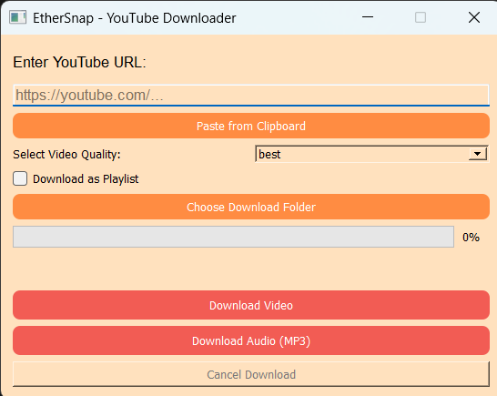
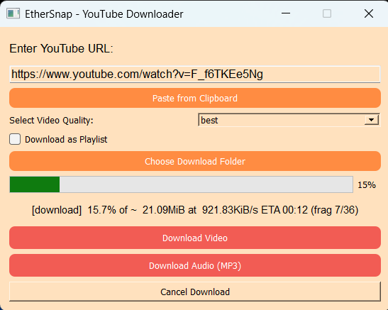

# 🎬 EtherSnap - YouTube Downloader Desktop App

[](./LICENSE)
[](https://www.python.org/downloads/)
[](https://pypi.org/project/PyQt5/)

**EtherSnap** is a modern, beautifully designed desktop application built with **PyQt5** that allows you to download YouTube videos or playlists in high quality — either as video or MP3 audio. It uses the powerful [yt-dlp](https://github.com/yt-dlp/yt-dlp) and [FFmpeg](https://ffmpeg.org/) tools under the hood for reliable and fast media processing.

---

## ✨ Features

- 🎨 **Modern and aesthetic UI** with gradient background and smooth design
- 🔁 **Single or Playlist** toggle for focused downloading
- 🎞️ **Video downloads** in multiple qualities (Best, 720p, etc.)
- 🎵 **Audio-only (MP3)** download support
- 📊 **Visual progress bar** with:
  - Download percentage
  - Download speed
  - File size and name
- 📋 **Clipboard support**
- 📂 **Choose download location**
- ❌ **Cancel download** button
- 🧰 Fully embedded `ffmpeg` and supports portable builds

---

## 📥 Download EXE

Want to skip setup and use the app directly?

👉 [**Download EtherSnap for Windows (.exe)**](https://github.com/Iskiron/EtherSnap/releases/latest)

- No installation needed
- Portable `.exe` version
- ✅ Includes `yt-dlp.exe` and `ffmpeg.exe` (embedded)
- Just run and start downloading instantly!

> ⚠️ If your browser or Windows Defender warns you, it’s a common false positive for unsigned `.exe` files. The app is safe and open-source.


> 📢 **Disclaimer**  
> This app is intended for **personal and educational use only**. Downloading copyrighted content may violate YouTube’s [Terms of Service](https://www.youtube.com/t/terms).  
> The developers of EtherSnap are **not responsible** for misuse or legal consequences.

---

## 🛠️ How to Set Up EtherSnap (For Developers)

### 1. Clone the Repository

```bash
git clone https://github.com/Iskiron/EtherSnap.git
cd EtherSnap
```

### 2. Install Requirements

Make sure Python 3.8+ is installed.

```bash
pip install pyqt5 yt-dlp pyperclip
```

### 3. Download & Setup FFmpeg

1. Go to [Gyan.dev FFmpeg Builds](https://www.gyan.dev/ffmpeg/builds/)
2. Download **`ffmpeg-release-essentials.zip`** (Windows builds)
3. Extract it and place the `ffmpeg.exe` (from `bin/`) into the root directory of this project.

Your folder structure should look like:

```
/EtherSnap
  ├── EtherSnap.py
  ├── ffmpeg.exe
  ├── EtherSnap.ico
  └── ...
```

### 4. Run the App

```bash
python EtherSnap.py
```

---

## 📦 How to Create Executable (.exe) with PyInstaller

### Install PyInstaller

```bash
pip install pyinstaller
```

### Build the Executable

```bash
pyinstaller --onefile --windowed --icon=EtherSnap.ico --add-binary "ffmpeg.exe;." EtherSnap.py
```

This will generate a `dist/EtherSnap.exe` file you can run directly.

---

## 🖼️ Screenshots

| Home Page | Downloading |
|-----------|-------------|
|  |  |


---

## ⚖️ License

This project is licensed under the **MIT License**.  
See the [LICENSE](./LICENSE) file for full details.

### Included Dependencies

- [**yt-dlp**](https://github.com/yt-dlp/yt-dlp) – Licensed under the [Unlicense License](https://unlicense.org/).  
  Full license details in the [yt-dlp-LICENSE.txt](./third_party_licenses/yt-dlp-LICENSE.txt). 
- [**FFmpeg**](https://ffmpeg.org/) – Licensed under the [GNU LGPL or GPL](https://www.gnu.org/licenses/old-licenses/lgpl-2.1.html), depending on the build.  
  Full license details in the [ffmpeg-LICENSE.txt](./third_party_licenses/ffmpeg-LICENSE.txt).
  EtherSnap uses the [Windows build from Gyan.dev](https://www.gyan.dev/ffmpeg/builds/), which is usually **LGPL-compliant**.

> ❗ You must retain and mention the licenses of all third-party binaries included or used in this app when redistributing.

---

## ⚠️ Disclaimer

This software is intended for **personal and educational purposes** only.  
Downloading copyrighted content without permission **may** violate YouTube’s [Terms of Service](https://www.youtube.com/t/terms).

**EtherSnap does not promote piracy or illegal usage.**  
The developers of EtherSnap are **not responsible** for misuse or legal consequences.

---

## 🤝 Contributing

We welcome community contributions!

1. Fork the repo
2. Create a new branch: `feature/your-feature-name`
3. Make your changes
4. Submit a Pull Request

Please ensure your code is **clean**, **tested**, and **well-documented**.

---

## 📫 Contact

Made by **Iskiron**  
🔗 [LinkedIn](https://www.linkedin.com/in/abhijeetydv) 

---
